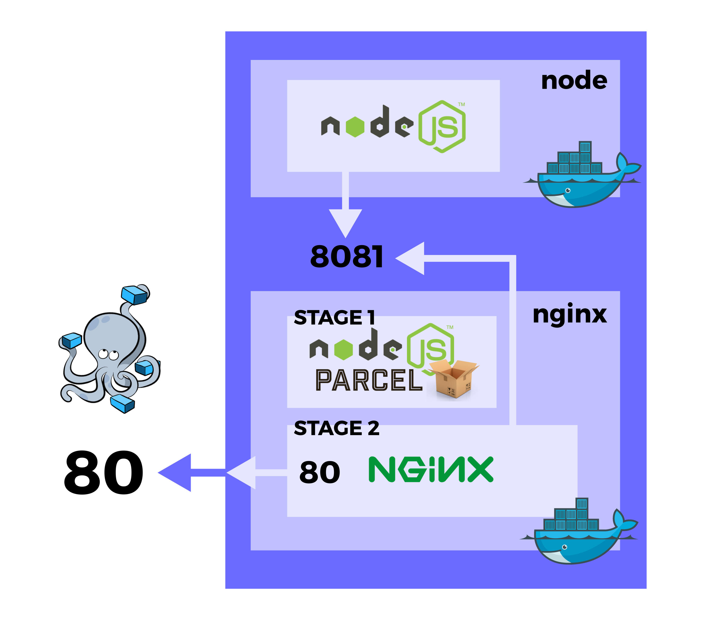
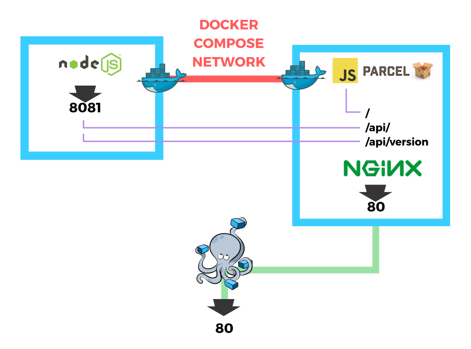

# Guía de consejos/ayudas de Docker



- Revisa bien los videos del tema de clase. En algunos de ellos hay consejos sobre como estructurar ciertos ficheros necesarios para esta práctica.

## Backend

1. Asegurate de tener la estructura correcta de carpetas:

```
.dockerignore
.gitignore
data.json
Dockerfile
package.json
package-lock.json
run.sh
server.js
```

2. El fichero `run.sh` debe tener los comandos de Docker para crear los contenedores. Una configuración recomendada podría ser la siguiente:

```
docker build -t usuario/app_node
docker run --rm --name backtest -p 8081:8081 usuario/app_node
```

La primera línea genera una imagen llamada `usuario/app_node` a partir del Dockerfile. Si no hay cambios, es instantáneo.

La segunda línea crea un contenedor a partir de la imagen `usuario/app_node`. Además, hace varias cosas:

- `--rm` elimina el contenedor cuando lo cierras
- `--name backtest` le pone nombre al contenedor
- `-p 8081:8081` envía todo lo que sale por el puerto `8081` del contenedor al puerto `8081` de la máquina local. Esto es _muy importante_ para las pruebas.

* El fichero `run.sh` solo sirve para propósitos de prueba mientras construímos la imagen. Más adelante lo haremos todo con Docker Compose.

3. Si quieres hacer pruebas temporales en un contenedor, puedes hacer lo siguiente:

- Ejecuta `docker exec -it backtest bash`
- Esto abrirá una terminal de bash en el contenedor con nombre `backtest` donde podrás hacer pruebas y examinar como se encuentra dicho contenedor.
- Por ejemplo, puedes hacer lo siguiente: `apt-get update && apt-get install curl -y`. Una vez hecho esto, puedes hacer `curl localhost:8081` y observar si el servidor de la máquina está funcionando dentro del contenedor.

4. Los pasos importantes del `Dockerfile`:

- Usar una imagen node
- Copiar el package.json a la imagen
- Hacer un npm install
- Copiar los archivos necesarios a la imagen
- Ejecutar `node server.js` (con CMD, por ejemplo)

## Frontend

1. Asegurate de tener la estructura correcta de carpetas:

```
.dockerignore
.gitignore
Dockerfile
nginx.conf
package.json
package-lock.json
run.sh
src/
```

2. De la misma forma que el anterior, el fichero `run.sh` debe tener los comandos de Docker correspondientes:

```
docker build -t usuario/app_front
docker run --rm --name fronttest -p 80:80 usuario/app_front
```

En esta ocasión indicamos que el puerto `80` de este contenedor se envíe al puerto `80` del equipo anfitrión.

En este punto tendremos un backend en el puerto `8081` y un frontend en el puerto `80`.

3. Si alguno está teniendo problemas de **CORS**, se pueden evitar facilmente de la siguiente forma:

Dentro del `app.get()` de la petición que tengamos problemas, devolvemos la siguiente cabecera:

```
res.header("Access-Control-Allow-Origin", "*");
```

No es lo más adecuado respecto a seguridad (_estamos permitiendo cualquier dominio_). Lo ideal sería poner el dominio al que dar permiso en lugar de `*`, pero ya que no hemos entrado en detalles sobre este tema en el curso, valdrá con esto para evitar CORS.

4. Los pasos importantes del `Dockerfile`:

Fase build

- Usar node como imagen
- Copiar el package.json a la imagen
- Hacer un npm install (y la instalación global/local de parcel)
- Copiar los archivos de la app a la imagen
- Generar el build

Fase production

- Usar nginx como imagen
- Copiar config de nginx a `/etc/nginx/conf.d/default.conf`
- Copiar la carpeta del build de la fase anterior a `/usr/share/nginx/html`
- Ejecutar nginx en modo demonio `nginx -g daemon off;`

5. Configuración de Nginx

- Ten al menos 3 `location` para cada ruta que nos interesa:

```
location / {
  ...
}

location /api/version/ {
  ...
}

location /api/ {
  ...
}
```

En la primera hay que indicar la carpeta donde hemos copiado nuestro build.
En la segunda hay que hacer un `proxy_pass` a nuestro backend. Esto es:

- `proxy_pass http://localhost:8081/` si estamos trabajando sin Docker Compose
- `proxy_pass http://node:8081/` cuando empecemos a trabajar con Docker Compose. `node` es el nombre del servicio que usamos para Node en Docker Compose.

En la tercera es el mismo caso, pero a la ruta `http://node:8081/api/`.

## Docker Composer

El paso de Docker compose es el último, donde unimos los dos contenedores mediante una red interna de Docker.

1. Asegurate de tener la estructura correcta de carpetas:

```
backend/
frontend/
docker-compose.yml
run.sh
```

2. El fichero `run.sh` debe construir y levantar los servicios definidos en el archivo `docker-compose.yml`, esto es:

```
docker-compose build && docker-compose up
```

3. El `docker-compose.yml` debe definir:

- Dos servicios (por ejemplo `nginx` y `node`)
- Enlazarlos mediante la misma network
- Abrir al menos el puerto de nginx hacia fuera
- Indicar en `build` el contexto de cada servicio (al construir la imagen de Docker)

4. Recuerda asegurarte de que en el `nginx.conf` has puesto el nombre del servicio de node en el host del proxy_pass.

Otro gráfico que muestra el esquema de puertos y elementos utilizados en Docker Compose:


