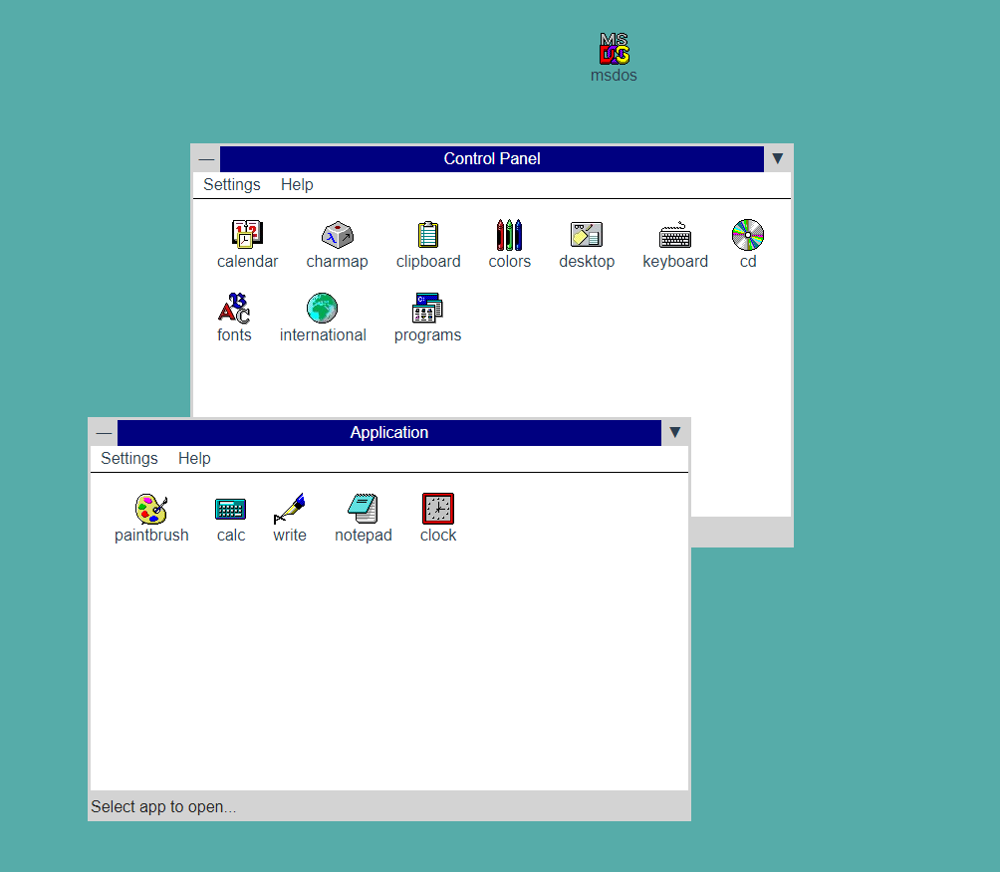

### VueJS

- [🎬 1. Introducción a VueJS y frameworks](https://youtu.be/69p2P_lMquw)
- [🎬 2. Bases de VueJS](https://youtu.be/gywq51XOE2Y)
- [🎬 3. Props, data, methods y otros](https://youtu.be/RR41WId4H6Y)
- [🎬 4. Single File Components (SFC)](https://youtu.be/gdiOKYb18mc)
- [🎬 5. Comunicación entre componentes](https://youtu.be/-8TqED4Vr-M)
- [📗 Slides](https://docs.google.com/presentation/d/1NfU2bxIaDjsA2ZkbMo3xytfXq5or2crVRlZf1W9RoHI/present)
- [Previsualización de la práctica](practica-win311.mp4)

- Nota: Ojo. El despliegue de Vue cambia respecto al visto con Parcel. Pueden crear un fichero `vue.config.js` en la raíz del proyecto y utilizar [publicPath](https://cli.vuejs.org/config/#publicpath) para indicar el nombre del repo del proyecto (equivalente al parámetro **--public-path** de Parcel). En [Despliegues en Vue](https://cli.vuejs.org/guide/deployment.html#github-pages) tienen más información. En lugar de hacer el `deploy.sh`, pueden continuar usando el paquete `gh-pages`, pero tengan en cuenta que Vue guarda el build en la carpeta `dist` en lugar de `build`.

#### Recursos

1. Scaffolding de un proyecto Vue.
   - [Vue CLI](https://cli.vuejs.org/)
   - Estructura de carpetas.
2. [Componentes SFC](https://vuejs.org/v2/guide/single-file-components.html) de Vue
   - Templating en Vue SFC. [Directivas](https://vuejs.org/v2/guide/syntax.html#Directives).
   - Scripting en Vue SFC. [Componentes](https://vuejs.org/v2/guide/components-registration.html#Local-Registration)
   - Estilos en Vue SFC. [Styles](https://vuejs.org/v2/guide/comparison.html#HTML-amp-CSS)
   - [Comunicación entre componentes](https://vuejs.org/v2/guide/components.html#Listening-to-Child-Components-Events)
3. Extras de VueJS
   - Rutas en Vue: [vue-router](https://vuejs.org/v2/guide/routing.html)
   - Idiomas en Vue: [vue-i18n](https://kazupon.github.io/vue-i18n/)

#### Práctica

En esta práctica, vamos a utilizar **VueJS** y su sistema de componentes para crear una imitación visual del sistema de ventanas del entorno gráfico de [Windows 3.11](https://es.wikipedia.org/wiki/Windows_3.1). Obviamente, una versión, muy, muy simplificada.

La parte que particularmente interesa de la práctica es trabajar con el concepto de componentes de VueJS, que probablemente se perciba como una mejora de la DX (Experiencia del desarrollador) a la hora de crear componentes. Para ello vamos a crear como mínimo 2 componentes básicos (ventana e icono) que utilizaremos en la práctica: `Win311Window` y `Win311Icon`. Cada uno de ellos tendrá la lógica que afecta a cada componente y lo que se pretende es tener una versión visual de este escritorio (como se ve en la imagen).

Para ello, seguiremos los siguientes pasos mínimos:

1. Crea la estructura de carpetas (_scaffolding_) utilizando el CLI de Vue (`@vue/cli`). Con él se te configurará _automágicamente_ toda la estructura de carpetas para sólo tener que enfocarte en los componente SFC de Vue.

2. El componente principal (la aplicación, el fichero `App.vue`) simplemente contendrá el fondo de pantalla (_en la imagen de ejemplo, un fondo verde turquesa_) 2 ventanas y un icono (llamando a nuestros propios componentes).

3. El componente `Win311Window` debe contener toda la estructura de la ventana (_puedes crear más componentes de apoyo si lo deseas_) y tendrá una zona donde aparecerán los iconos, que son nuestro otro componente: `Win311Icon`, que muestra el icono y el nombre.

4. En el archivo [icons.zip](icons.zip) tienes una colección de iconos de **Windows 3.11** que puedes utilizar para colocar en tu práctica. Recuerda meterlos en la carpeta `assets`. Para importarlos desde el componente de Vue, recomiendan utilizar el `require` de Node.

5. Las ventanas tendrán una prop `type` que dará a conocer en el interior del componente, de que ventana se trata (Control Panel, Apps, Games...) y que iconos tiene asociados. La ventana deben mostrar obligatoriamente, al menos, un título y una colección de iconos.

6. Los iconos por su parte, recibirán una prop `name` que indicará el icono del que se trata (puedes utilizar el mismo nombre del icono si quieres).

7. En esta ocasión pasamos a utilizar el cli de Vue, el cuál no utiliza **Parcel** por debajo, sino **Webpack**, por lo que algunas cosas cambiarán. Investiga como hacer el despliegue a GitHub Pages, de forma similar a como lo hacíamos con Parcel. Recuerda que debes cambiar la URL al desplegar en GitHub Pages, similar a como lo hacíamos con el parámetro `--public-url` y la carpeta `build`. Documéntalo en el README. Puedes encontrar información de ayuda en [esta página](https://cli.vuejs.org/guide/deployment.html#github-pages).

#### Criterios importantes

- Scaffolding de Vue (Vue-cli)
- Aspecto visual / Despliegue en GH-Pages
- Estructura de App.vue
- Componente Win311Window
- Componente Win311Icon

### Retos

1. Interesaria que cada vez que el usuario pulse en el icono de una ventana, se resalte el fondo del texto para indicar que ese icono está seleccionado. Normalmente, esto se gestiona con una gestión de estados (no cubierto en este tema), pero para simplificar la práctica, simplemente podemos hacerlo utilizando _props_ y _custom events_.

2. Para evitar hacer click en varios iconos y se seleccionen todos, podemos hacer uso de emitir eventos hacia el padre. Se puede emitir un evento `unselect` que lo recoja el padre y mande un `unselect` a todos los hijos. Te puede venir bien `this.$children`, que es un array de componentes, hijo de un componente.

3. Al hacer doble click sobre un icono, debe mostrar un `alert()` indicando el nombre icono que se ha seleccionado.

4. ¿Te animas a incluir alguna mejora en la práctica? Detállalo en el `README.md` como **Reto extra** y se tendrá en cuenta a la hora de evaluarla.
